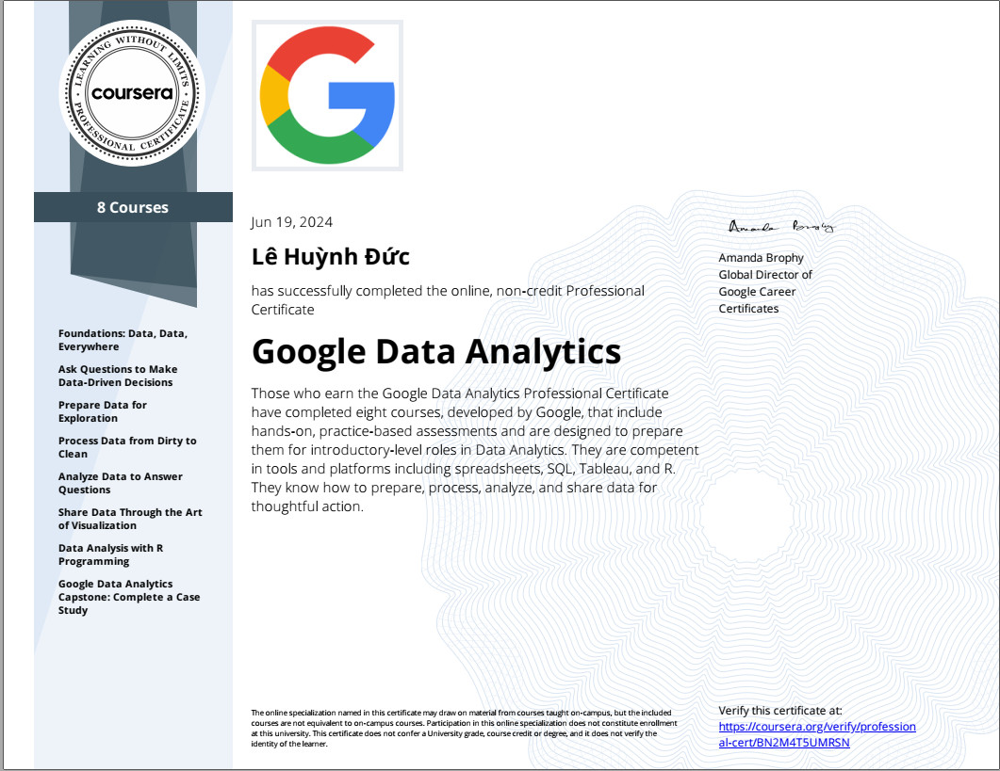
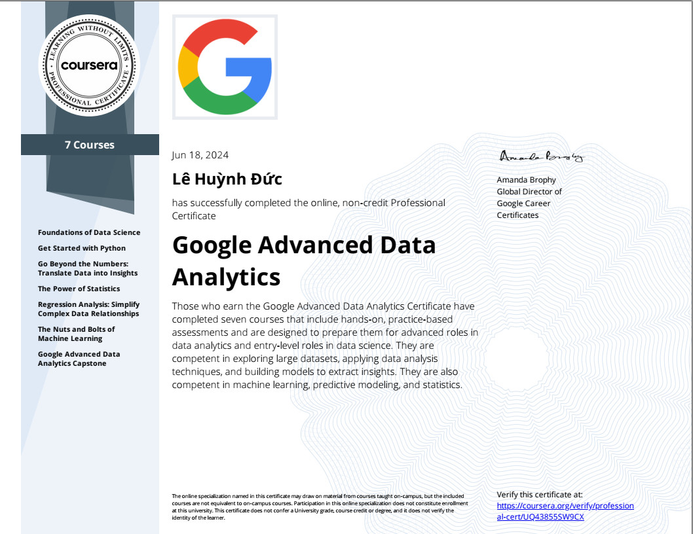
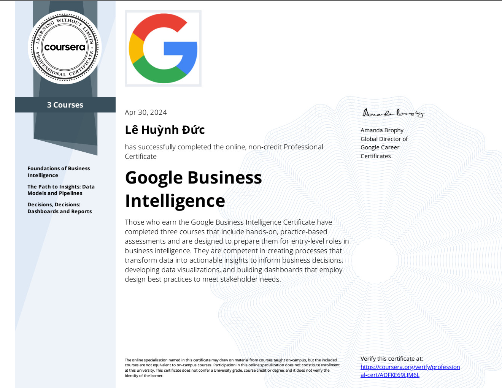

## 🌐Socials
  

# 🛠 Languages and Tools
               

 ## Certificates
>
> <a href="./Certificate/1.jpg">
>    
> </a>
> <a href="./Certificate/2.jpg">
>    
> </a>
>  <a href="./Certificate/3.jpg">
>    
> </a>
>  <a href="./Certificate/4.jpg">
>    
> </a>

# 📊 GitHub Stats

### ✍️ Random Dev Quote

